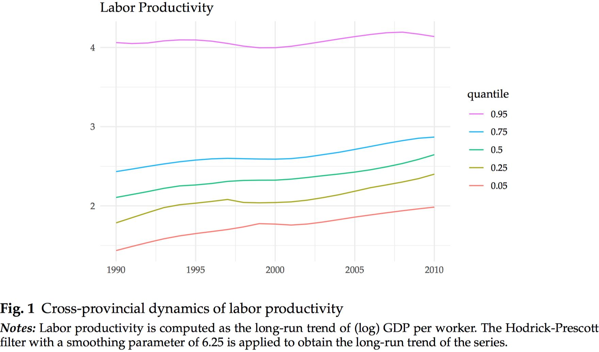

```{r setup, include=FALSE}
options(htmltools.dir.version = FALSE)
```


## Motivation:

- Large regional inequality in Indonesia (Esmara 1975; Mishra 2009; Kataoka 2018)

  - A large literature focuses on the **_dynamics_** of regional inequality 
      - MOST papers use the classical convergence approach of Barro and Sala-i-Martin (1991)
          - Describe the dynamics of the "average" region  (Garcia and Soelistianingsih 1997; Resosudarmo and Vidyattama 2006; Hill, Resosudarmo, and Vidyattama 2007;  Vidyattama 2013; 2014).

      -  FEW papers study the dynamics of regional convergence "beyond the average" (Sakamoto 2007; Kurniawan et. al, 2019)

  - Kurniawan et. al (2019 Reg. Sci PP) use the novel convergence approach of Phillips and Sul (2007 Econometrica) to study regional income convergence in Indonesia **_beyond the average_**
      - Focus on **the role of heteregeneity** both across regions and over time
      - Provinces in Indonesia are converging to TWO separate clubs


## Research Objective:
  
Study the determinants of regional per-capita income: labor productivity, capital accumulation and efficiency


  - Labor productivity = F(Physical capital, Human capital, Efficiency)

---

class: middle

## Methods:

- Nonlinear dynamic factor model  (Phillips and Sul, 2007, 2009)
- Clustering algorithm for panel data (Phillips and Sul, 2007, 2009)

## Data:

- Labor productivity, phyical capital, human capital, efficiency (Katoka, 2013,2018)
- 26 Indonesian provinces over the 1990-2010 period 


## Main Results:

1. Cross-provincial dynamics of labor productivity are characterized by **TWO convergence clubs**

2. The dynamics of the proximate determinants of labor productivity show some mixed results:

  - Physical and human capital are characterized by **multiple convergence clubs** (FOUR and TWO convergence clubs, respectively)
  - Two alternative measures of efficiency are characterized by **ONE convergence club** 

---

class: middle

# Outline of this presentation

1. Some stylized facts

2. Convergence framework (intuition)

3. Main results of the paper

  - Two convergence clubs in labor productivity
  - Four convergence clubs in physical capital
  - Two convergence clubs in human capital
  - One convergence club in efficiency (non-parametric and parametric)


<br />
<br />
[ Slides and paper available at: http://bit.ly/arsc2019 ]

---

class: center, middle

# (1) Some stylized facts
**Regional heterogeneity across Indonesia**


---

class: middle,center

## Are there any signs of convergence in labor productivity?




---

class: middle,center

## Are there any signs of convergence in the determinants of labor productivity?


---

class: center, middle

# (2) Convergence framework

Convergence test (intuition)

Convergence clubs (intuition)


---
class: middle

# Convergence framework (brief overview)

- First, define a relative transition parameter, $h_{it}$, as

$$h_{it}=\frac{y_{it}}{\frac{1}{N}\sum_{i=1}^{N}y_{it}}$$

- Second, the convergence hypothesis is defined as

$$H_{t}=\frac{1}{N}\sum_{i=1}^{N}\left(h_{it}-1\right)^{2}\rightarrow 0$$

In other words, when the relative transition parameter converges to unity, $h_{it}\rightarrow1$, the cross-sectional variance converges to zero, $H_{t}\rightarrow0$.


- Thrid, Phillips and Sul (2007) test this hypothesis by using the following log t regression model

$$log\left(\frac{H_{1}}{H_{t}} \right)-2log\left\{ log\left(t\right)\right\}  =  a+b\:log\left(t\right)+\epsilon_{t}$$

---
class: middle, center

# Convergence test (intuition)


---
class: middle, center

# Convergence clubs (intuition)


---
class: middle, center

# (3) Main results

Overall results

Characteristics of the two convergence clubs in labor productivity

Characteristics of the multiple convergence clubs in capital accumulation

Characterstics of the unique convergence club in efficiency 

---
class: middle, center

## Overall results: Convergence and Divergence


---
class: middle, center

## LABOR PRODUCTIVITY: Two convergence clubs


---
class: middle, center

## LABOR PRODUCTIVITY: Members of the clubs


---
class: middle, center

## PHYSICAL CAPITAL: Four convergence clubs


---
class: middle, center

## PHYSICAL CAPITAL: Members of the clubs


---
class: middle, center

## HUMAN CAPITAL: Two convergence clubs


---
class: middle, center

## HUMAN CAPITAL: Members of the clubs


---
class: middle, center

## EFFICIENCY: One convergence club


Note: Efficiency is measured in absolute levels using a Cobb-Douglas production function with elasticity parameter of 0.33. The mean and the 95 confidence interval is computed for each year 
---

class: middle

# Concluding Remarks


Reject the (overall) convergence hypothesis in labor productivity and two of its determinants: physical capital and human capital
  - Labor productivity: Two largely separated clubs
  - Physical capital: Four clubs with separating trends at the extremes
  - Human capital: Two clubs with separating trends

A unique convergence club in efficiency
  - Low effeciency club: Is this a low-efficiency trap?

## Implications, discussion, and further research

Regional heterogeneity is a pervasive feature in Indonesia (and many developing countries)
  - The need for an analaytical framework that focuses on heterogeneity and goes beyond the average

Convergence clubs may help us identify economies facing similar challenges
  - Call for better coordination and cooperation policies both within and between clubs

Masked within provinces in Indonesia, there is still a high degree of heterogeneity that is worth exploring. 
  - Using district level data is the next step and using firm level data is the following


---

class: center, middle

# Thank you very much for your attention

https://carlos-mendez.rbind.io

Slides and working paper available at: http://bit.ly/arsc2019


**Quantitative Regional and Computational Science lab**

https://quarcs-lab.rbind.io

***

C. Mendez: This research project was supported by JSPS KAKENHI Grant Number 	19K13669 

